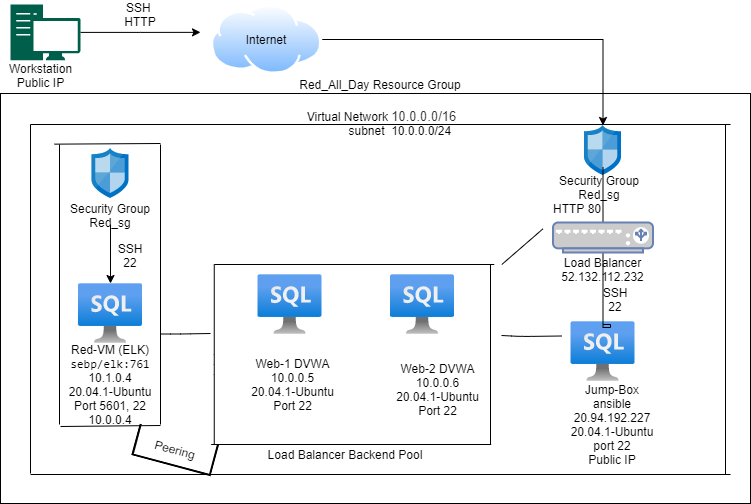

# washu_project
## Automated ELK Stack Deployment

The files in this repository were used to configure the network depicted below.

These files have been tested and used to generate a live ELK deployment on Azure. They can be used to either recreate the entire deployment pictured above. Alternatively, select portions of the playbook file may be used to install only certain pieces of it, such as Filebeat.

* [my-playbook.yml](./Ansible/my-playbook.yml) - Used to install DVWA Servers.
* [elk.yml](./Ansible/elk.yml) - Used to install Elk Server.
* [filebeat-playbook.yml](./Ansible/filebeat-playbook.yml) - Used to install and configure Filebeat on ELK Server and DVWA Server.
* [mtericbeat-playbook.yml](./Ansible/metric-playbook.yml) - Used to 
 
This document contains the following details:
- Description of the Topology
- Access Policies
- ELK Configuration
  - Beats in Use
  - Machines Being Monitored
- How to Use the Ansible Build

### Description of the Topology

The main purpose of this network is to expose a load-balanced and monitored instance of DVWA, the D*mn Vulnerable Web Application.

Load balancing ensures that the application will be highly available, in addition to restricting access to the network. Load balancers protect the servers from becoming overloaded with traffic (DDOS attack), by shifting traffic. The advantage of a jump box is given access to the user from a single node that can be secured and monitored by administrators.

Integrating an ELK server allows users to easily monitor the vulnerable VMs for changes to the logs and system traffic.
- Filebeat helps generate and organize log files to send to Logstash and Elasticsearch. Specifically, it logs information about the file system, including which files have changed and when.
- Metricbeats records the metrics and statistics that it collects and ships them to the output that you specify, such as Elasticsearch or Logstash.

The configuration details of each machine may be found below.
_Note: Use the [Markdown Table Generator](http://www.tablesgenerator.com/markdown_tables) to add/remove values from the table_.

| Name                 | Function       | IP Address             | OS    |
|----------------------|----------------|------------------------|-------|
| Jump-Box-Provisioner | Gateway        | 10.0.0.4/20.94.192.227 | Linux |
| Web-1                | Web Server     | 10.0.0.5               | Linux |
| Web-2                | Web Server     | 10.0.0.6               | Linux |
| Red-VM (ELK server)  | ELK Server     | 10.1.0.4/52.247.66.56  | Linux |
| Load Balancer        | Load Balancer  | 52.137.112.232         | Linux |
| Workstation         | Access control | Public IP             | Linux

### Access Policies

The machines on the internal network are not exposed to the public Internet. 

Only the Red-VM (ELK) machine can accept connections from the Internet. Access to this machine is only allowed from the following IP addresses:
Workstation Public IP through TCP 5601
Machines within the network can only be accessed by Workstation & Jump-Box-Provisioner.
- Jump-Box-Provisioner IP : 10.0.0.4 via SSH port 22
- Workstation Public IP via port TCP 5601

A summary of the access policies in place can be found in the table below.

| Name          	| Publicly Accessible 	| Allowed IP Addresses                 	|
|---------------	|---------------------	|--------------------------------------	|
| Jump Box      	| No                  	| Workstation  Public IP            	|
| Web-1         	| No                  	| 10.0.0.5 SSH 22                      	|
| Web-2         	| No                  	| 10.0.0.6 SSH 22                      	|
| Red-VM (ELK)  	| No                  	| Workstation Public IP using TCP 5601 	|
| Load Balancer 	| No                  	| Workstation Public IP on HTTP 80  	|

### Elk Configuration

Ansible was used to automate configuration of the ELK machine. No configuration was performed manually, which is advantageous because Ansible lets you quickly and easily deploy multitier apps. You won't need to write custom code to automate your systems; you list the tasks required to be done by writing a playbook, and Ansible will figure out how to get your systems to the state you want them to be in.

The playbook implements the following tasks:
- Install Docker
- Download Image
- Configure container
- Create playbook to install container with docker and Filebeat and                        
   Metricbeat.
- Run playbook to launch the container

The following screenshot displays the result of running `docker ps` after successfully configuring the ELK instance.

### Target Machines & Beats
This ELK server is configured to monitor the following machines:
- Web-1 10.0.0.5
- Web-2 10.0.0.6

We have installed the following Beats on these machines:
- Filebeat 
- Metricbeat 

These Beats allow us to collect the following information from each machine:
- Filebeat monitors the log files or locations that you specify, collects log events, and forwards them either to Elasticsearch or Logstash for indexing. When Filebeat starts logging, it will represent data such as system log events in a dashboard.
- Metricbeat periodically collect metrics from the operating system and from services running on the server. Metricbeat takes the metrics and statistics that it collects and ships them to the output that you specify, such as Elasticsearch or Logstash. Metricbeat will display information such as container CPU usage.
### Using the Playbook
In order to use the playbook, you will need to have an Ansible control node already configured. Assuming you have such a control node provisioned: 

SSH into the control node and follow the steps below:
- Copy the ansible ELK installation file to Elk server.
- Update the yml file to include installer
- Run the playbook, and navigate to http://52.247.66.56:5601 to check that the installation worked as expected.

_TODO: Answer the following questions to fill in the blanks:_
-  Which file is the playbook elk.yml
-  Where do you copy it? /etc/ansible
-  Which file do you update to make Ansible run the playbook on a specific machine? /etc/ansible/hosts
- How do I specify which machine to install the ELK server on versus which to install Filebeat on?etc/ansible/hosts you can specify what severs to install Filebeat on.
-  Which URL do you navigate to in order to check that the ELK server is running?

_As a **Bonus**, provide the specific commands the user will need to run and download the playbook
- download the playbook: etc/ansible/ use curl command wget
- run playbook: ansible-playbook <playbook name.yml
- update the files: nano /etc/ansible/hosts
